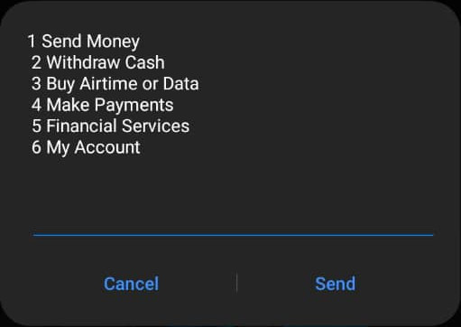

[Home](./README.md)

# Terminology

Hi there! In this part, we’ll explain certain terms you’ll come across throughout the rest of the documentation.

# Session

Suppose you took out your phone and wanted to access some service via USSD (Let’s use Vodafone Mobile Money for our example), you’d start with ***110#** followed by a series of inputs to navigate through the menus, until you finalize your transaction with your mobile money PIN. 

For our Vodafone money transfer example, your interaction would look like the image below:

This entire interaction, from the dialing *110#, to entering your PIN is what we refer to as a SESSION.

**The entire goal of AutoUssd is to allow you to setup these sessions in your dashboard which are then executed within your Android applications via the SDK**.

# Menu

In the previous paragraph, we established what a session is. Each step in a session is what we refer to as a **MENU**. Below is an image of a single menu from the session above. We’ll explore menus into detail in the [Menus](./03.Menus.md) section.

# SMS Parser

Usually, after completing a USSD transaction, an SMS message is sent to your device, and you’d have to read the SMS text to determine whether the transaction was ultimately successful or it failed.

You can instruct the SDK to read incoming SMS messages from a specific sender using an **SMS PARSER**. We’ll explore SMS parsers into detail in the [SMS Parsers](./04.Parsers.md) section.

# App

When building your Android applications, you might use a few or several sessions per Android application you build. Having all your sessions lumped up can be quite confusing and difficult to manage.

To keep things organized, you can group your sessions under an **APP** you create in your dashboard. **In essence, an APP is a collection of SESSIONS**.

# Conclusion

We’ve talked about quite a bit but the main takeaways from this section are as follows:

1. A **Session** represents a USSD interaction
2. Sessions are made up of one or more **Menus**
3. Sessions can have **SMS Parsers** which read incoming SMS to determine if a session succeeded or failed
4. To keep things organized, sessions are grouped into **Apps**

---

Next Up: [Sessions](./02.Sessions.md)
