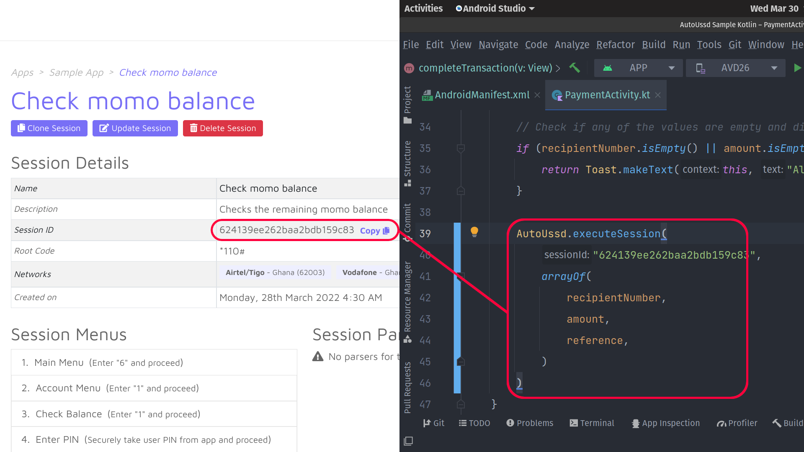

[Home](./README.md)

# Build A Sample App - Android (Kotlin)

In the [Build a Sample App - Setup](./05.Build-Sample-App-Setup) guide, we setup an app on our dashboard and a session to send money from a Vodafone mobile money account to another.

In this guide, we’ll build a simple sample Android app using **Kotlin** which will utilize our session.

# Requirements

1. Android Studio 4.0 or higher
2. Android SDK 12 (API level **31**) or higher
3. Android `minSdkVersion` of **23** or higher
4. Android `compileSdkVersion` of **31** or higher

# Clone Sample Starter App

To get started, clone the sample starter app using the command below

```shell
git clone https://github.com/autoussd/autoussd-sample-kotlin.git
```

# Install AutoUssd

Next, we'll install the SDK in our cloned starter app

1. Open the **project level** `build.gradle` file and add the following to the `allprojects` block

```groovy
allprojects {
  repositories {
    ...
    /* Add AutoUssd Maven repository */
    maven { url "https://raw.github.com/autoussd/autoussd-aar/master" }
  }
}
```

2. Open the **app level** `build.gradle` file and add the following to the `dependencies` block

```groovy
dependencies {
  ...
  /* Add AutoUssd dependency */
  implementation 'com.autoussd:autoussd-sdk:3.1.0'
}
```

3. Sync your project with Gradle to download the dependencies
4. Test if the everything is working correctly by running the app either on a physical device or on the Android emulator. If all is well, you should get an interface similar to this


# Setup `AndroidManifest.xml`

Now, we’ll now configure the `AndroidManifest.xml` to retrieve the sessions in our app on our dashboard

1. Copy your **app id** from your app in your dashboard


2. Add a `<meta-data/>` tag in the `AndroidManifest.xml` and paste your **app id** as its value

```xml
<application>
  ...
    
  <!-- TODO: Add AutoUssd app id meta-data tag -->
  <meta-data 
    android:name="com.autoussd.APP_ID" 
    android:value="YOUR APP ID"
  />
</application>
```

# Setup `PaymentActivity.kt`

The last thing to do is to invoke the SDK to execute our session.

1. Copy and replace the `PaymentActivity.kt` with the following code block

```kotlin
package com.autoussd.sample.kotlin

import android.os.Bundle
import android.view.View
import android.widget.EditText
import android.widget.Toast
import androidx.activity.ComponentActivity
import com.autoussd.AutoUssd

class PaymentActivity : ComponentActivity() {
    override fun onCreate(savedInstanceState: Bundle?) {
        super.onCreate(savedInstanceState)
        setContentView(R.layout.activity_payment)
        
        AutoUssd.init(this)
    }

    override fun onDestroy() {
        super.onDestroy()
        
        AutoUssd.dispose()
    }

    @Suppress("UNUSED_PARAMETER")
    fun completeTransaction(v: View) {
        // Get references to the EditText components in the view
        val recipientNumberInput = findViewById<EditText>(R.id.numberInput)
        val amountInput = findViewById<EditText>(R.id.amountInput)
        val referenceInput = findViewById<EditText>(R.id.referenceInput)

        // Get the recipient number, amount and reference from the EditText components
        val recipientNumber = recipientNumberInput.text.toString()
        val amount = amountInput.text.toString()
        val reference = referenceInput.text.toString()

        // Check if any of the values are empty and display a toast message if so
        if (recipientNumber.isEmpty() || amount.isEmpty() || reference.isEmpty()) {
            return Toast.makeText(this, "All fields are required", Toast.LENGTH_LONG).show()
        }

        AutoUssd.executeSession(
            "624139ee262baa2bdb159c83",
            arrayOf(
                recipientNumber,
                amount,
                reference,
            ),
            null // Important
        )
    }
}
```

2. Copy your **session id** from your session in your dashboard and paste in the `completeTransaction` method



# For The Laid Back Devs

If you'd rather not go through the tutorial and examples, you can checkout the `sdk-testing` branch which contains the full implementation of AutoUssd. Check it out using the command

```bash
git checkout sdk-testing
```

# Testing

Awesome, we’ve finished our setup. Our app should now be able to execute our session to transfer money from a Vodafone account to another via Vodafone Cash.

A few notes to consider

1. This guide works for a **Vodafone cash enabled SIM card**. If you use another networks, modify the guide where necessary.
2. You’ll need an internet connection for the first run. This allows the SDK to download the app and session data from the server
3. **The app will transfer actual money to the specified recipient number**

Now let’s run our app and test it.


# Conclusion

Yaaay 🎉🎉🎉! You’ve reached the end of this guide and have built your first app using AutoUssd!

You’ve just scratched the surface of how you can use USSD session automation in Android apps. Whether building apps for personal use or commercial use, the possibilities are endless. We’d love to see the many awesome ways you will use AutoUssd 😊.

If you encounter any problems, kindly open an issue on our [Github Issues](https://github.com/autoussd/autoussd-aar/issues) page and we’ll respond swiftly to them. Now go and create the next big thing!


---

Back: [Build a Sample App - Platform Selection](./06.Build-Sample-App-Platforms.md)    Next Up: [Interpreting the SDK Result](08.Interpreting-SDK-Result.md)
